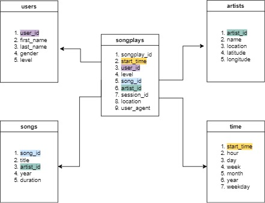

# Introduction
The goal of this project is to analyze Sparkify data (songs and user activities) on the new music streaming app, and to understand what songs users are listening to. A Postgres database and ETL pipeline is created to optimize queries on song play analysis.

# Database schema design and ETL process

Relevant information from logs are extracted and a database 'sparkifydb' is created. Following tables are created:
### Fact Table
songplays: records in log data associated with song plays i.e. records with page NextSong
### Dimension Tables
users: users in the app
songs: songs in music database
artists: artists in music database
time: timestamps of records in songplays broken down into specific units

# Files in repository
1. test.ipynb displays the first few rows of each table.
2. create_tables.py connects to the database, drops and creates tables. Make sure to run this file to reset tables before each time running ETL scripts. 
3. etl.ipynb reads and processes a single file from song_data and log_data and loads the data into tables. This notebook contains detailed instructions on the ETL process for each of the tables.
4. etl.py is the main script doing ETL process. It reads and processes JSON files from song_data and log_data and loads them into tables. 
5. sql_queries.py contains all SQL queries, and is imported into the last three files above.

# Instructions
1. Run create_tables.py to create database and tables.
2. Run etl.py to extract, transform and load all records into the database.

